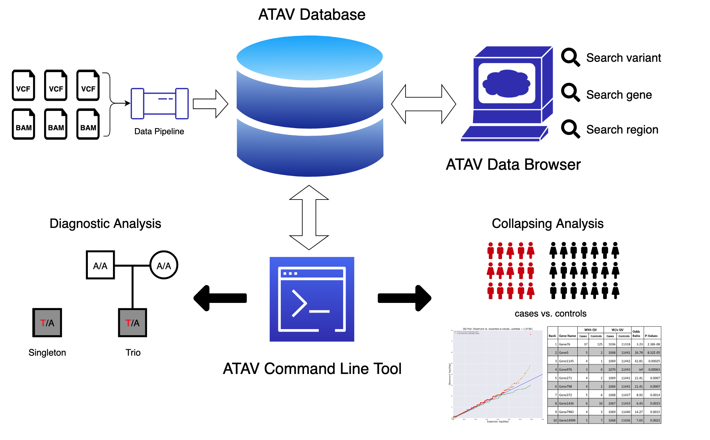

# ATAV

### ATAV is an open-source platform for population-scale genomic analyses including the database, the command line tool and the data browser.



#### ATAV is fully deployable in AWS, click [here](https://github.com/nickzren/atav/wiki/AWS-Setup) for details.

#### This repository contains code and data primarily for the ATAV command line tool. Click to check the repository for the [ATAV Database](https://github.com/nickzren/atav-database) and the [ATAV Data Browser](https://github.com/nickzren/atavdb).

#### If you have any questions, feel free to contact Nick Ren (<a href="mailto:z.ren@columbia.edu">z.ren@columbia.edu</a>)

## ATAV Command Line Tool

The ATAV command line tool is the interface to the ATAV database. Written in java, ATAV consists of three modules. (i) The command line parser and query engine translate user defined parameters and the input sample list (in PLINK’s ped format) into an efficient SQL query for interrogating the relational database, (ii) A runtime variant object creator parses SQL output into a collection of variant objects. Each variant object includes variant information (genomic coordinates, annotation), variant calls in the sample list, sample genotype calls at co-ordinates without a called variant and external annotation data. (iii) A statistical analyses module iterates over the variant objection collection to perform downstream analyses. ATAV currently supports tests for diagnostic analyses such as identifying putative de novo and inherited genotypes of interest in trios, and a framework for performing region-based rare-variant collapsing analyses that identify genes or other genomic units that carry an excess of qualifying variants among cases in comparison to the background variation observed in internal controls of convenience in the ATAV database. 

The modularized ATAV framework makes it extensible to continuously develop new functions that operate on sequencing/variant data sets. Critical to data integrity, all ATAV analyses allow an auditable log of software and database version, filter parameters adopted, the input sample lists used in the specific run and the runtime logs that ensure full reproducibility.  

Check the [User's Guide](http://redmine.igm.cumc.columbia.edu/projects/atav/wiki) for more details.

## Citation

If you use ATAV for a publication, please cite:

```
Zhong Ren, Gundula Povysil, David B. Goldstein. (2020) ATAV: a comprehensive platform for population-scale genomic analyses. bioRxiv DOI: 10.1101/2020.06.08.136507
```
